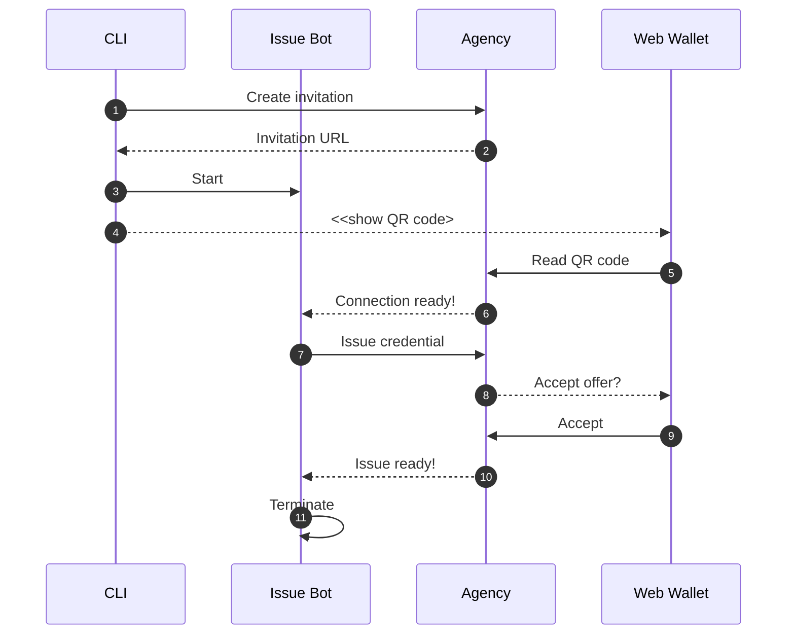
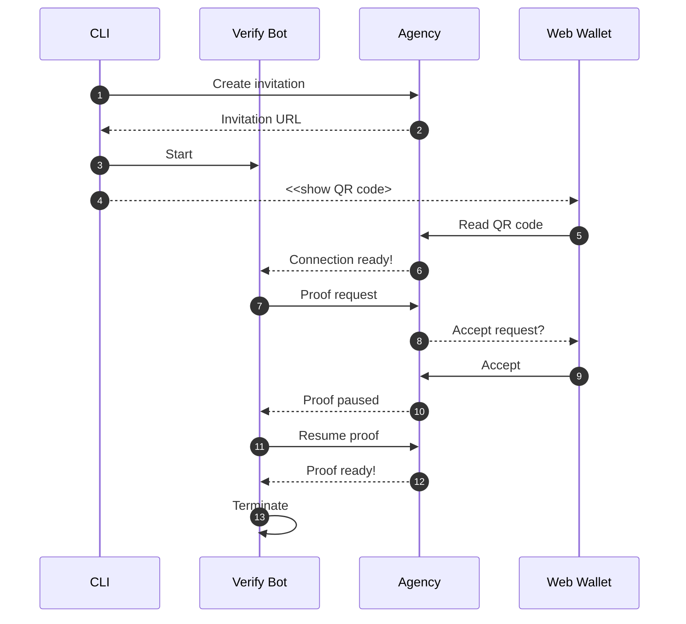

# CLI example

## Flow

### Initialization


### Issue credential



### Verify proof




## Requirements

* [findy-agent-cli](https://github.com/findy-network/findy-agent-cli#installation)
* `qrencode`

    Mac:

    ```bash
    brew install qrencode
    ```

## Define env variables

[Described here](../README.md#setup-env-variables-for-the-agency-connection)

## Run the script

```bash
./run.sh
```

You can ignore the rpc errors that CLI prints out after canceling issuer/verifier bot.

## Testing

1. Read the QR code with your wallet application or
paste the invitation url to the "Add Connection" dialog input field.
1. Accept the credential sent from the CLI. Hit C-c once the credential is saved.
1. Read the QR code with your wallet application or
paste the invitation url to the "Add Connection" dialog input field.
1. Accept the proof request sent from this server. Hit C-c once the proof request is accepted.

## More examples

* [Findy Agency demo](https://github.com/findy-network/findy-agency-demo)
* [CLI usage examples](https://github.com/findy-network/findy-agent-cli#cli-usage-examples)
